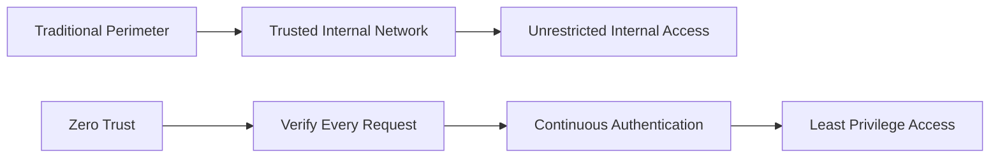

# Zero Trust Architecture Deep Dive

Zero Trust has evolved from a buzzword to a fundamental security paradigm that's reshaping how organizations approach cybersecurity. As traditional perimeter-based security models crumble under the weight of cloud adoption, remote work, and sophisticated threats, Zero Trust offers a path forward built on the principle of "never trust, always verify."

## Understanding Zero Trust Fundamentals

Zero Trust is not a product or a single technology—it's an architectural approach that assumes breach and verifies every transaction, regardless of location or user credentials.

### Core Principles

1. **Verify Explicitly**: Always authenticate and authorize based on all available data points
2. **Use Least Privileged Access**: Limit user access with Just-In-Time and Just-Enough-Access (JIT/JEA)
3. **Assume Breach**: Minimize blast radius and segment access; verify end-to-end encryption

## The Zero Trust Architecture Model

### Traditional vs. Zero Trust Security Models



The fundamental shift moves from location-based trust to identity and context-based verification.

## Implementation Strategy

### Phase 1: Assessment and Planning

Before implementing Zero Trust, organizations must understand their current security posture:

#### Asset Inventory
- **Data Classification**: Identify and classify all sensitive data
- **Application Mapping**: Document all applications and their interdependencies
- **Network Topology**: Map current network architecture and traffic flows
- **Identity Systems**: Catalog all identity providers and authentication mechanisms

#### Risk Assessment
```python
# Example: Risk scoring framework
def calculate_risk_score(asset):
    factors = {
        'data_sensitivity': asset.classification_level,
        'exposure_level': asset.internet_facing,
        'vulnerability_count': len(asset.vulnerabilities),
        'business_criticality': asset.business_impact
    }
    
    risk_score = sum(factors.values()) / len(factors)
    return min(risk_score, 10.0)  # Cap at 10
```

### Phase 2: Identity and Access Management

The foundation of Zero Trust lies in robust identity verification:

#### Multi-Factor Authentication (MFA)
Implement strong authentication across all access points:
- **Adaptive MFA**: Risk-based authentication that adjusts requirements
- **Passwordless Authentication**: FIDO2, biometrics, and certificate-based auth
- **Privileged Access Management**: Enhanced controls for administrative access

#### Identity Governance
```yaml
# Example: Identity policy configuration
identity_policies:
  user_lifecycle:
    provisioning: automated
    review_cycle: quarterly
    deprovisioning: immediate_on_termination
  
  access_requests:
    approval_workflow: manager_and_data_owner
    access_duration: time_limited
    periodic_review: enabled
```

### Phase 3: Device Security and Compliance

Every device accessing corporate resources must be verified and compliant:

#### Device Trust Framework
- **Device Registration**: All devices must be enrolled and managed
- **Compliance Monitoring**: Continuous assessment of device health
- **Conditional Access**: Access decisions based on device posture

#### Endpoint Detection and Response (EDR)
Implement comprehensive endpoint monitoring:
- **Behavioral Analytics**: Detect anomalous device behavior
- **Threat Hunting**: Proactive search for indicators of compromise
- **Automated Response**: Immediate containment of compromised devices

## Network Segmentation and Micro-segmentation

### Software-Defined Perimeters (SDP)

Replace traditional VPNs with dynamic, identity-based network access:

```typescript
interface SDPConnection {
  userId: string;
  deviceId: string;
  applicationId: string;
  accessPolicy: AccessPolicy;
  encryptionKeys: EncryptionKeys;
  sessionTimeout: number;
}

class ZeroTrustGateway {
  async establishConnection(request: ConnectionRequest): Promise<SDPConnection> {
    // Verify user identity
    const userVerification = await this.verifyUser(request.credentials);
    
    // Check device compliance
    const deviceCompliance = await this.checkDeviceHealth(request.deviceId);
    
    // Evaluate access policy
    const accessDecision = await this.evaluatePolicy(
      userVerification, 
      deviceCompliance, 
      request.targetResource
    );
    
    if (accessDecision.granted) {
      return this.createSecureConnection(request);
    }
    
    throw new AccessDeniedException(accessDecision.reason);
  }
}
```

### Application-Level Segmentation

Implement granular controls at the application layer:
- **API Gateway Security**: Centralized policy enforcement
- **Service Mesh**: Encrypted service-to-service communication
- **Database Security**: Row-level and column-level access controls

## Data Protection and Classification

### Data-Centric Security

Zero Trust extends beyond network and device security to protect data itself:

#### Information Rights Management (IRM)
- **Dynamic Data Classification**: Automated content analysis and labeling
- **Usage Controls**: Persistent protection that travels with data
- **Access Tracking**: Comprehensive audit trails for data access

#### Cloud Data Security
```python
# Example: Data Loss Prevention (DLP) policy
class DataProtectionPolicy:
    def __init__(self):
        self.rules = [
            {
                'pattern': r'\b\d{3}-\d{2}-\d{4}\b',  # SSN pattern
                'action': 'block',
                'classification': 'PII'
            },
            {
                'pattern': r'\b\d{16}\b',  # Credit card pattern
                'action': 'encrypt',
                'classification': 'Financial'
            }
        ]
    
    def evaluate_content(self, content: str) -> SecurityAction:
        for rule in self.rules:
            if re.search(rule['pattern'], content):
                return SecurityAction(
                    action=rule['action'],
                    reason=f"Detected {rule['classification']} data"
                )
        return SecurityAction.ALLOW
```

## Monitoring and Analytics

### Security Information and Event Management (SIEM)

Centralized logging and correlation are crucial for Zero Trust:

#### Key Metrics to Monitor
1. **Authentication Events**: Success/failure rates, unusual patterns
2. **Access Patterns**: Resource access frequency and timing
3. **Device Compliance**: Health status and policy violations
4. **Network Traffic**: Unusual communications and data flows

### User and Entity Behavior Analytics (UEBA)

Machine learning-powered anomaly detection:
- **Baseline Establishment**: Normal behavior patterns for users and entities
- **Anomaly Detection**: Identification of deviations from established baselines
- **Risk Scoring**: Dynamic risk assessment based on multiple factors

## Implementation Challenges and Solutions

### Common Pitfalls

1. **Trying to Implement Everything at Once**
   - *Solution*: Phased implementation starting with highest-risk areas

2. **Focusing Only on Technology**
   - *Solution*: Include process changes and user training

3. **Insufficient Identity Management**
   - *Solution*: Invest in robust identity governance and lifecycle management

### Change Management

Zero Trust implementation requires organizational change:
- **Executive Sponsorship**: Ensure leadership support and budget allocation
- **User Training**: Educate users on new security procedures
- **Cultural Shift**: Move from implicit trust to verification mindset

## Real-World Case Study: Global Financial Services Firm

### Challenge
A multinational bank needed to secure access for 50,000+ employees across 40 countries while meeting strict regulatory requirements.

### Implementation
1. **Identity Consolidation**: Unified identity management across all regions
2. **Risk-Based Authentication**: Dynamic MFA based on user risk profile
3. **Application Modernization**: API-first architecture with embedded security
4. **Continuous Monitoring**: Real-time threat detection and response

### Results
- 60% reduction in security incidents
- 40% improvement in user productivity
- Full regulatory compliance across all jurisdictions
- $2.3M annual savings in security operations

## Cloud-Native Zero Trust

### Kubernetes Security

Implementing Zero Trust in containerized environments:

```yaml
# Example: Kubernetes Network Policy
apiVersion: networking.k8s.io/v1
kind: NetworkPolicy
metadata:
  name: zero-trust-policy
spec:
  podSelector:
    matchLabels:
      app: sensitive-app
  policyTypes:
  - Ingress
  - Egress
  ingress:
  - from:
    - podSelector:
        matchLabels:
          role: authorized-client
    ports:
    - protocol: TCP
      port: 8080
  egress:
  - to:
    - podSelector:
        matchLabels:
          app: database
    ports:
    - protocol: TCP
      port: 5432
```

### Serverless Security

Zero Trust principles in serverless architectures:
- **Function-Level Authorization**: Granular permissions for each function
- **API Gateway Integration**: Centralized authentication and rate limiting
- **Runtime Security**: Monitoring and protection of serverless function execution

## Future of Zero Trust

### Emerging Technologies

1. **AI-Powered Security**: Machine learning for adaptive access controls
2. **Quantum-Safe Cryptography**: Preparing for post-quantum security
3. **Decentralized Identity**: Blockchain-based identity management

### Industry Trends

- **Zero Trust as a Service**: Cloud-native Zero Trust platforms
- **Regulatory Mandates**: Government requirements for Zero Trust adoption
- **Integration Standards**: Standardized APIs and protocols for interoperability

## Conclusion

Zero Trust architecture represents a fundamental shift in cybersecurity thinking—from perimeter-based security to identity and context-based verification. While implementation can be complex and requires significant organizational commitment, the benefits far outweigh the challenges.

Organizations that successfully implement Zero Trust will be better positioned to defend against modern threats, comply with evolving regulations, and enable secure digital transformation.

The journey to Zero Trust is not a destination but an ongoing evolution of security practices that must adapt to changing threats and business requirements.

---

*Are you considering Zero Trust implementation in your organization? What challenges are you facing? I'd love to discuss your specific use case and share insights from successful implementations.*
